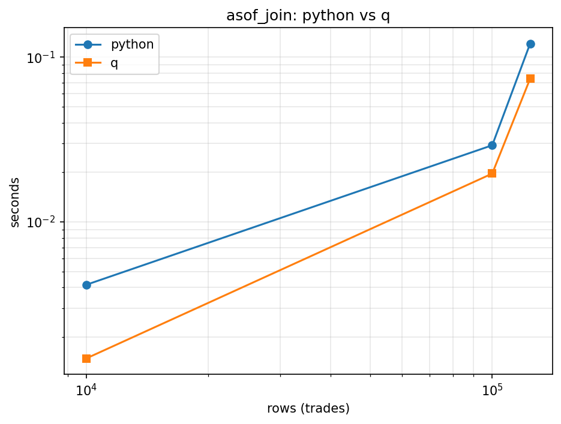
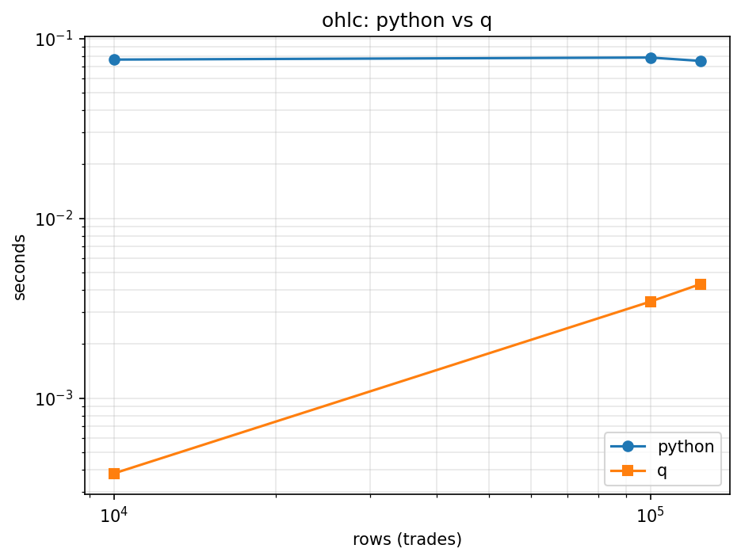
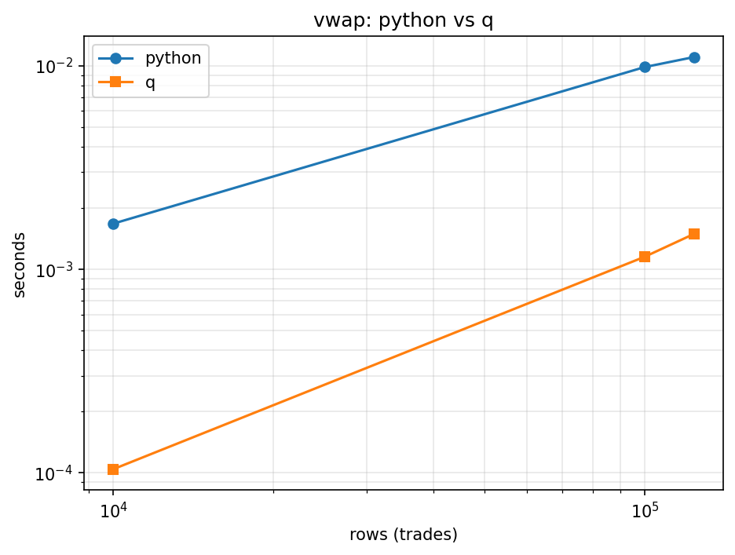

# kdb+/q vs Python: Market Microstructure Benchmark

A tick-data analytics engine implemented twice — once in Python (pandas) and once in kdb+/q — over real NASDAQ trade/quote data (LOBSTER free samples: AAPL, AMZN, GOOG, INTC, MSFT, 2012-06-21, level 1). Both implementations compute the same set of market microstructure operations from the same data, are validated row-for-row against each other, and are then benchmarked head-to-head at three data-size tiers.

No synthetic data anywhere — every row is real NASDAQ tick data.

## What it does

- **Asof join**: for each trade, the most recent quote at or before its timestamp (per symbol).
- **OHLC bars**: 5-minute open/high/low/close/volume bars, per symbol.
- **VWAP**: volume-weighted average price, per symbol.
- **Spread metrics**: midpoint, quoted spread (`ask-bid`), effective spread (`2*|price-midpoint|`).
- **Trade classification**: simple midpoint rule (price above midpoint → buy, below → sell), checked against LOBSTER's ground-truth trade direction.

## Data

| File | Rows |
|---|---|
| `data/all_trades.csv` | 123,984 |
| `data/all_quotes.csv` | 1,041,889 |

Schema:
- **trade**: `time, sym, price, size, side` (`side` is LOBSTER's ground truth, derived from which resting limit order was hit)
- **quote**: `time, sym, bid, ask, bidSize, askSize`

## Repo layout

```
data/           all_trades.csv, all_quotes.csv (real LOBSTER data)
python/         analytics.py (reference implementation), benchmark.py
q/              schema.q, analytics.q (idiomatic port), benchmark.q
results/        benchmark CSVs + charts
progress.md     status log and full decisions/findings trail
roadmap.md      phased build plan
```

## How to run

**Python** (pandas, run natively):
```
python python/analytics.py     # correctness checks, prints summary
python python/benchmark.py     # timings + charts to results/
```

**q/kdb+** (this project runs it inside WSL; adjust if you have a native install):
```
q q/analytics.q      # correctness checks, prints summary
q q/benchmark.q       # timings, writes results/benchmark_q.csv
```
Both q scripts expect to be run from the repo root (they load `data/` and `q/schema.q` via relative paths).

## Correctness

The q port is not a line-by-line translation — it uses idiomatic q (`aj`, `xbar`, `wavg`) rather than mimicking pandas' structure. Both implementations were validated row-for-row: **0 mismatches** on price, bid, ask, spreads, trade classification, and OHLC bars across all 123,984 merged trade rows and 390 bars; VWAP differs by ~1e-13, floating-point summation-order noise. See `progress.md` for the two real bugs this validation caught (a pandas sort-stability issue and a kdb+ float-comparison-tolerance issue) and how they were fixed.

## Benchmark results

Full-dataset tier (123,984 trades / 1,041,889 quotes), python vs q:

| Operation | Python | q | Speedup |
|---|---|---|---|
| Asof join | 0.1209s | 0.0740s | ~1.6x |
| OHLC bars | 0.0341s | 0.0044s | ~7.8x |
| VWAP | 0.0110s | 0.0015s | ~7.4x |

Each number is the median of 5 timed repeats, in both languages.

q is faster at every tier and every operation.





### Caveats

- **In-memory only.** This doesn't test kdb+'s on-disk historical database engine, splayed tables, or partitioned queries — just in-memory operations on data already loaded into each process.
- **Chronological subsampling.** The 10k/100k tiers take the first N rows by time, not a random sample, so they skew toward the market-open period (the busiest window of the trading day).
- **q's asof-join timing includes setup cost.** kdb+'s `aj` needs the quote table sorted sym-then-time with a `` `p# `` (parted) attribute on `sym` to use its fast binary-search path — without it, the full-dataset join took ~283 seconds instead of ~0.03 seconds (see `progress.md`). Because the benchmark's chronological tiering needs pure time order (which strips that attribute), q's reported `asof_join` time includes re-sorting and re-tagging each tiered subsample, not just the join itself. Python's `merge_asof` has no equivalent attribute to lose.
- **Idiomatic, not literal, q port.** The q code uses q's native vectorized/functional tools throughout; a naive line-by-line translation from pandas would likely be slower and would understate kdb+'s real advantage.
- **Trade classification uses a simple midpoint rule**, not the full Lee-Ready algorithm (no tick test for trades exactly at the midpoint), so its ~74.8% agreement with LOBSTER's ground truth reflects that simplification, not a bug.

Full narrative of what was tried, what broke, and why — including the two real bugs found during validation and the two q-specific discoveries made while building the benchmark — is in `progress.md`.
